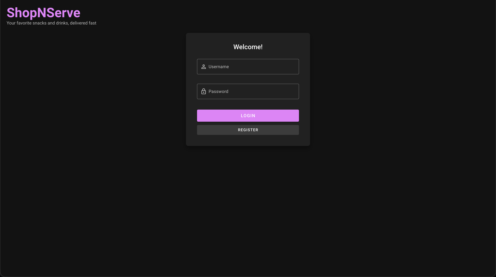
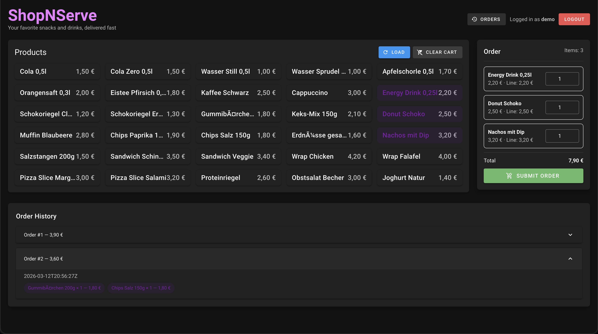
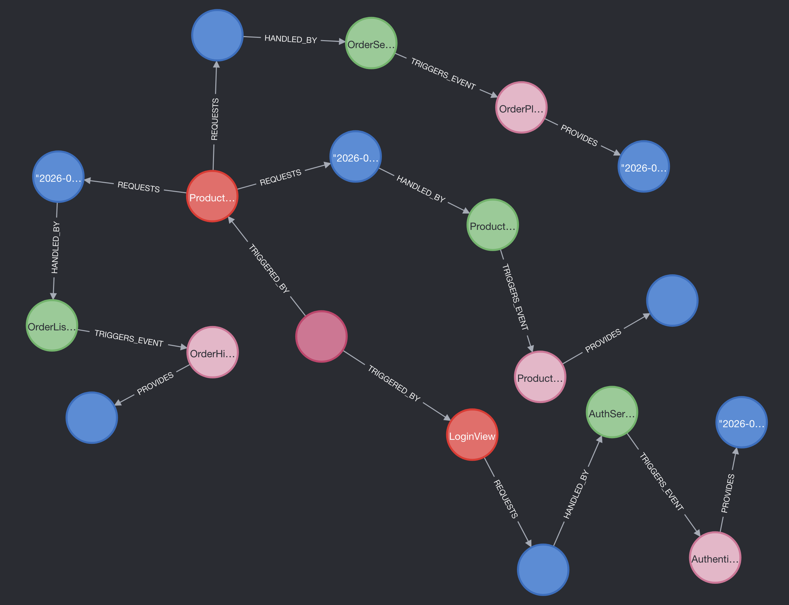

# 🛒 ShopNServe

ShopNServe is a small **event-driven shop application** developed as part of a **university project on data-driven system architectures**.

The application allows users to:

- browse products
- add items to a cart
- place orders
- view order history

The main purpose of the project is to demonstrate how modern architectural patterns can be implemented in a real system.

The project focuses on:

- **Blackboard Architecture**
- **event-driven communication**
- **traceability of system interactions**
- **integration of multiple data stores**

---

## Table of Contents

- Project Goals
- Conceptual Architecture
- Architectural Patterns Used
- Architecture Overview
- System Interaction Flow
- Capability Requests and Responses
- Tech Stack
- Frontend
- Backend
- Data Storage
- Running the Project
- Neo4j Visualization

---

# 🎯 Project Goals

The goal of this project is not only to build a shop application, but to explore **architectural design patterns**.

The system demonstrates:

- Blackboard architecture
- Event-driven backend processing
- Decoupled frontend-backend communication
- Graph-based tracing of system interactions
- Use of multiple specialized databases

The system combines:

| Layer | Technology |
|------|-------------|
| `Frontend` | Vue 3 + Vuetify |
| `Backend` | Spring Boot |
| `Transactional Database` | MySQL |
| `Interaction Graph` | Neo4j |

---

# 🧠 Conceptual Architecture

The application follows a **Blackboard architecture**.

Instead of calling many specialized backend endpoints directly, the frontend sends **capability-based events** to a central orchestration component called **BlackboardService**.

The BlackboardService is responsible for:

- receiving capability-based requests from the frontend
- validating authentication
- routing requests to the correct handler
- delegating business logic to dedicated services
- recording the interaction flow in Neo4j

This design keeps the frontend **loosely coupled** from backend implementation details and makes the system easier to trace and analyze.

---

# 🧩 Architectural Patterns Used

This project combines several architectural patterns to demonstrate how modern distributed systems can be designed, analyzed, and extended.

The goal is not only to implement a functional application, but to showcase how architectural concepts influence system structure and interaction flow.

---

## Blackboard Architecture

The system is primarily based on the **Blackboard architectural pattern**.

Instead of allowing the frontend to directly call different backend services, all requests are routed through a central orchestration component:

`BlackboardService`

This component acts as a **central coordination hub** that:

- receives capability-based requests from the frontend
- validates authentication
- determines which handler should process the request
- coordinates backend processing
- records system interactions for traceability

This architecture provides several advantages:

- loose coupling between components
- centralized orchestration
- easier extension with new capabilities
- improved observability of system interactions

---

## Event-Driven Communication

The system implements an **event-driven communication model** to decouple the frontend from backend services.

Instead of exposing many specialized REST endpoints, the frontend sends **events describing the requested capability**.  
These events are received by the `BlackboardService`, which routes them to the appropriate handler.

Example event:

```json
{
  "traceId": "session-id",
  "sender": {
    "component": "ProductListView.vue",
    "application": "Shop-Microclient"
  },
  "capabilities": ["ProductList"],
  "payload": {
    "action": "listProducts"
  }
}
```

This event-driven communication model provides several benefits:
- reduced coupling between frontend and backend services
- a single unified API entry point
- easier extension of system functionality
- flexible routing of requests based on capabilities

---

## Capability-Based Request Routing

Instead of routing requests via different endpoints, the system routes them based on **capabilities**.

Each capability represents a specific system function that the frontend wants to execute.  
The frontend sends these capabilities as part of an event to the central `BlackboardService`.

The `BlackboardService` evaluates the requested capability and forwards the request to the appropriate **CapabilityHandler** implementation.

| Capability | Description |
|-------------|-------------|
| `Authentication` | user login and registration |
| `ProductList` | retrieval of product data |
| `OrderPlaced` | creation of new orders |
| `OrderHistory` | retrieval of previous orders |

Each capability is processed by a dedicated **CapabilityHandler**.

This routing mechanism provides several advantages:

- clear separation of responsibilities between handlers
- easy extension of the system by adding new capabilities
- reduced coupling between frontend and backend components
- simplified API design with a single entry point

Because all requests are routed through the `BlackboardService`, the system can dynamically determine which backend component should process the request based on the declared capability.

---

## Graph-Based Interaction Tracing

A key architectural feature of this system is the ability to **trace system interactions as a graph**.

All requests and responses are recorded in **Neo4j** using the service:

`SessionGraphIngestService`

Instead of only storing business data, the system also records how components interact during runtime.

The interaction graph captures:

- user sessions
- UI components triggering requests
- backend components processing requests
- executed capabilities
- request payloads
- response payloads

This approach enables the system to reconstruct and analyze how requests move through the architecture.

Representing interactions as a graph enables:

- visualization of system workflows
- tracing of request lifecycles
- analysis of component dependencies
- debugging of complex interactions

By storing runtime interactions in Neo4j, the system becomes **transparent and observable**, allowing developers to better understand how components collaborate during execution.

---

## Separation of Concerns

The system architecture follows the principle of **Separation of Concerns**, where different components are responsible for clearly defined tasks.

The application is organized into several architectural layers:

| Layer | Responsibility |
|------|----------------|
| `Frontend` | user interface and event generation |
| `Controller` | REST entry point for frontend requests |
| `Orchestration` | central coordination of system interactions |
| `Handlers` | capability-specific request processing |
| `Services` | business logic implementation |
| `Repositories` | database access |
| `Databases` | persistent data storage |

Each layer has a distinct responsibility, which improves:

- maintainability
- scalability
- readability of the codebase
- testability of individual components

This layered design ensures that changes in one part of the system have minimal impact on other parts, making the architecture easier to evolve over time.

---

# 🏗 Architecture Overview

```text
            ┌────────────────────────────────────────────────────────────────────┐
            │                           Frontend Layer                           │
            │                    Vue 3 + Vuetify + TypeScript                    │
            │                             Shop.vue                               │
            └────────────────────────────────┬───────────────────────────────────┘
                                             │
                                             │ POST /api/blackboard/messages
                                             ▼
            ┌────────────────────────────────────────────────────────────────────┐
            │                        Controller Layer                            │
            │                      BlackboardController                          │
            └────────────────────────────────┬───────────────────────────────────┘
                                             ▼
            ┌────────────────────────────────────────────────────────────────────┐
            │                     Orchestration Layer                            │
            │                       BlackboardService                            │
            │        central routing, validation, and coordination               │
            └────────────────────────────────┬───────────────────────────────────┘
                                             │
        ┌────────────────────────┬───────────┼────────────┬────────────────────────┐
        ▼                        ▼                        ▼                        ▼
┌──────────────────┐   ┌──────────────────┐   ┌──────────────────┐   ┌──────────────────┐
│  Authentication  │   │   ProductList    │   │   OrderPlaced    │   │   OrderHistory   │
│     Handler      │   │     Handler      │   │     Handler      │   │     Handler      │
└────────┬─────────┘   └────────┬─────────┘   └────────┬─────────┘   └────────┬─────────┘
         ▼                      ▼                      ▼                      ▼
┌──────────────────┐   ┌──────────────────┐   ┌──────────────────┐   ┌──────────────────┐
│   AuthService    │   │  ProductService  │   │   OrderService   │   │ OrderListService │
└────────┬─────────┘   └────────┬─────────┘   └────────┬─────────┘   └────────┬─────────┘
         ▼                      ▼                      ▼                      ▼
┌──────────────────┐   ┌──────────────────┐   ┌──────────────────┐   ┌──────────────────┐
│   JwtService     │   │ ProductRepository│   │  OrderRepository │   │  OrderRepository │
└──────────────────┘   └────────┬─────────┘   └────────┬─────────┘   └────────┬─────────┘
                                │                      │                      │
                                └──────────────┬───────┴──────────────┬───────┘
                                               ▼                      ▼
                                       ┌────────────────────────────────────┐
                                       │               MySQL                │
                                       │     transactional business data    │
                                       └────────────────────────────────────┘

              ┌────────────────────────────────────────────────────────────────────┐
              │                     Interaction Tracing Layer                      │
              │                   SessionGraphIngestService                        │
              │         stores sessions, capabilities, and data flow               │
              └────────────────────────────────┬───────────────────────────────────┘
                                               ▼
                                   ┌──────────────────────┐
                                   │        Neo4j         │
                                   │ interaction graph DB │
                                   └──────────────────────┘          
```

---

# 🔄 System Interaction Flow

Every user interaction follows the same conceptual flow:

1. The frontend triggers an action  
2. A **capability-based event** is sent to the backend  
3. The event is received by the **BlackboardService**  
4. Authentication is validated  
5. The appropriate **CapabilityHandler** processes the request  
6. The response is returned to the frontend  
7. The interaction is recorded in **Neo4j**

---

# 📡 Capability Requests and Responses

Each frontend interaction is sent to the backend as a **capability-based event**.

The request contains **RequestedData**, which describes what the frontend asks the system to do.  
The backend processes the request and returns **ProvidedData**, which contains the result.

Both the request and response data are also stored in the **Neo4j interaction graph** to enable tracing and analysis of system behavior.

---

## Capability Overview

| Capability | Handler | RequestedData | ProvidedData |
|-------------|-------------|-------------|-------------|
| `Authentication` | `AuthenticationHandler` | username, password | authorization result, JWT token |
| `ProductList` | `ProductListHandler` | action: listProducts | list of available products |
| `OrderPlaced` | `OrderPlacedHandler` | username, ordered items | order confirmation, orderId |
| `OrderHistory` | `OrderHistoryHandler` | username | list of previous orders |

---

## Authentication

### RequestedData

```json
{
  "username": "demo",
  "password": "demo"
}
```

### ProvidedData

```json
{
  "authorized": true,
  "token": "jwt-token"
}
```

## ProductList

### RequestedData

```json
{
  "action": "listProducts"
}
```

### ProvidedData

```json
{
  "orders": [
    {
      "orderId": 42,
      "totalCents": 180,
      "items": [
        {
          "name": "Eistee Pfirsich 0.5l",
          "priceCents": 180
        }
      ]
    }
  ]
}
```

## OrderPlaced

### RequestedData

```json
{
  "username": "demo",
  "items": [
    {
      "productId": 1,
      "quantity": 2
    }
  ]
}
```

### ProvidedData

```json
{
  "success": true,
  "orderId": 42
}
```

## OrderHistory

### RequestedData

```json
{
  "username": "demo"
}
```

```json
{
  "orders": [
    {
      "orderId": 42,
      "totalCents": 180,
      "items": [ "name": "Eistee Pfirsich 0.5l", "priceCents": 180 ]
    }
  ]
}
```

---

# 🔁 Example Sequence: Loading the ProductList

```text
           User
             │
             │ Login
             ▼
     Frontend (Shop.vue)
             │
             │ capability: Authentication
             ▼
     BlackboardService
             │
             │ validate JWT
             ▼
    AuthenticationHandler
             │
             ▼
     User authenticated

-------------------------------------

           User
             │
             │ Click "Load Products"
             ▼
         Frontend
             │
             │ capability: ProductList
             ▼
     BlackboardService
             │
             ▼
     ProductListHandler
             │
             ▼
    MySQL (products table)
             │
             ▼
Products returned to frontend
```

---

# ⚙️ Tech Stack

## Frontend

The frontend is implemented using **Vue 3 with TypeScript** and the **Vuetify UI framework**.

It is responsible for handling all user interactions and translating them into **capability-based events** that are sent to the backend.

### Technologies

| Technology | Purpose |
|-------------|-------------|
| `Vue 3` | reactive frontend framework |
| `Vuetify` | UI component library |
| `TypeScript` | type-safe frontend development |

---

### Frontend Responsibilities

The frontend layer handles:

- user authentication
- displaying available products
- managing the shopping cart
- submitting orders
- displaying order history
- sending capability-based events to the backend

Instead of calling specific backend services directly, the frontend communicates through a **capability-based event system**.

This ensures that the frontend remains **loosely coupled** from backend services.

---

### Main Frontend Component

The application is mainly implemented in the component:

`Shop.vue`

This component manages the entire application interface and orchestrates several logical UI areas.

---

### UI Structure

The interface consists of several functional sections.

| UI Section | Description |
|------------|-------------|
| `Login Panel` | user authentication |
| `Product Grid` | displays available products |
| `Order Panel` | shows cart items and allows editing quantities |
| `Order History` | displays previously placed orders |

---

### Product Grid

Displays all available products retrieved from the backend.

Features:

- responsive grid layout
- product selection
- visual cart state
- price display

Products are loaded by sending the capability:

`ProductList`

to the backend.

---

### Shopping Cart / Order Panel

The order panel allows users to manage their cart.

Features:

- add/remove products
- edit quantities
- display total order price
- submit orders

Submitting an order triggers the capability:

`OrderPlaced`

---

### Order History

Users can view their previous orders.

Features:

- expandable order panels
- display of ordered items
- chip-based visualization of products
- order totals and timestamps

Order history is loaded via the capability:

`OrderHistory`

---

### Authentication Flow

The login form allows users to:

- register
- login

Authentication uses **JWT tokens**.

Workflow:

1. User submits credentials
2. Frontend sends capability: Authentication
3. Backend validates credentials
4. JWT token is returned
5. Token is stored in `localStorage`
6. Token is attached to all further requests

---

### Frontend → Backend Communication

The frontend communicates with the backend via a single API endpoint:

```text
POST /api/blackboard/messages
```

Each request contains:

- `traceId`
- `sender`
- `capabilities`
- `payload`

Example event:

```json
{
  "capabilities": ["ProductList"],
  "payload": {
    "action": "listProducts"
  }
}
```

This design ensures that the frontend does not depend on specific backend endpoints.

---

## Backend

The backend is implemented using **Spring Boot** and follows a **Blackboard Architecture**.

### Technologies

| Technology | Purpose |
|-------------|-------------|
| `Spring Boot` | backend framework |
| `Maven` | dependency management |
| `REST API` | communication layer |

---

### BlackboardService

The **central orchestration component**.

Responsibilities:

- receives all frontend events
- validates authentication
- routes events to capability handlers
- logs system interactions in Neo4j
- returns responses to the frontend

---

### Capability Handlers

Handlers implement the actual business logic.

| Handler | Capability | Description |
|--------|-------------|-------------|
| `AuthenticationHandler` | Authentication | login & registration |
| `ProductListHandler` | ProductList | fetch products |
| `OrderPlacedHandler` | OrderPlaced | store new orders |
| `OrderHistoryHandler` | OrderHistory | retrieve orders |

Handlers implement a shared interface:

```code
public interface CapabilityHandler {

  Capability capability();

  BlackboardResponse handle(MessageEventRequest event);

}
```

---

### OrderService

Handles order creation.

Responsibilities:

- calculate order totals
- convert cart items to JSON
- store orders in MySQL

---

### OrderListService

Handles order retrieval.

Responsibilities:

- load stored orders from MySQL
- prepare order history responses for the frontend

---

### SessionGraphIngestService

Responsible for recording **system interaction graphs**.

Tracks:

- sessions
- UI components
- backend components
- capabilities
- request and response data

---

# 🧩 Component Dependencies

The system consists of several loosely coupled components.

```text
Shop.vue
   │
   ▼
BlackboardController
   │
   ▼
BlackboardService
   │
   ├── AuthenticationHandler ──► AuthService ──► JwtService
   │
   ├── ProductListHandler ─────► ProductService ─────► ProductRepository
   │
   ├── OrderPlacedHandler ─────► OrderService ───────► OrderRepository
   │
   └── OrderHistoryHandler ────► OrderListService ───► OrderRepository

BlackboardService ─────────────► SessionGraphIngestService ─────► Neo4j
 ```

### Component Roles

| Component | Responsibility |
|-----------|---------------|
| `Shop.vue` | user interface and event creation |
| `BlackboardController` | REST entry point for frontend events |
| `BlackboardService` | central orchestration and routing |
| `AuthenticationHandler` | handles authentication requests |
| `ProductListHandler` | handles product list requests |
| `OrderPlacedHandler` | handles order creation requests |
| `OrderHistoryHandler` | handles order history requests |
| `AuthService` | authentication and login/register logic |
| `JwtService` | JWT token generation and validation |
| `ProductService` | retrieval of product data |
| `OrderService` | creation of new orders |
| `OrderListService` | retrieval of stored orders |
| `SessionGraphIngestService` | graph-based interaction tracing |
| `ProductRepository` | database access for products |
| `OrderRepository` | database access for orders |

---

# 🗄 Data Storage

The system uses **two databases with different responsibilities**.

---

# MySQL — Transactional Data

Stores actual business data.

## products

| column | description |
|------|-------------|
| `id` | product id |
| `name` | product name |
| `price_cents` | price in cents |
| `description` | product description |
| `stock` | available stock |
| `created_at` | creation timestamp |

---

## orders

| column | description |
|------|-------------|
| `id` | order id |
| `user_name` | username |
| `items` | JSON list of ordered products |
| `total_cents` | order total |
| `created_at` | order timestamp |

Orders store cart items as **JSON** to simplify the schema.

---

# Neo4j — Interaction Graph

Neo4j stores the **interaction graph of the system**.

This graph allows analyzing:

- which UI triggered a request
- which backend handled the request
- which capability was executed
- what data was produced

---

## Graph Nodes

| Node | Description |
|------|-------------|
| `Session` | represents one user session |
| `UIComponent` | frontend component that triggered the request |
| `BackendComponent` | backend service/handler involved in processing |
| `Capability` | executed capability |
| `RequestedData` | request payload stored in Neo4j |
| `ProvidedData` | response payload stored in Neo4j |

---

## Example Graph Flow

```text
   (Session)
       │
       │ TRIGGERED_BY
       ▼
   (UIComponent)
       │
       │ REQUESTS
       ▼
 (RequestedData)
       │
       │ HANDLED_BY
       ▼
(BackendComponent)
       │
       │ TRIGGERS_EVENT
       ▼
  (Capability)
       │
       │ PROVIDES
       ▼
 (ProvidedData)
```

---

# 🚀 Running the Project

## Requirements

- Docker
- Docker Compose
- Node.js
- Java 21

---

# Start the Application

Open the Terminal and navigate to the Project and backend/

```text
docker compose up --build
```

Services started:

| Service | Port |
|------|------|
| `Frontend` | 5176 |
| `Backend` | 8080 |
| `MySQL` | 3306 |
| `Neo4j` | 7474 |

---

# Reset Databases

Open the Terminal and navigate to the Project and backend/

```text
docker compose down -v
docker compose up --build
```

---

# 📊 Example Interaction Graph

The following diagram illustrates how a single user interaction is recorded inside the **Neo4j interaction graph**.

Example scenario:

1. A user logs in  
2. The frontend sends an **Authentication capability**  
3. The request is processed by the backend  
4. The response is returned to the frontend  
5. The entire flow is stored in Neo4j

```
               (Session)
                   │
                   │ TRIGGERED_BY
                   ▼
        (UIComponent: LoginView)
                   │
                   │ REQUESTS
                   ▼
            (RequestedData)
                   │
                   │ HANDLED_BY
                   ▼
(BackendComponent: AuthenticationHandler)
                   │
                   │ TRIGGERS_EVENT
                   ▼
      (Capability: Authentication)
                   │
                   │ PROVIDES
                   ▼
            (ProvidedData)
```

---

## Graph Interpretation

Each node in the graph represents a part of the system interaction.

| Node | Meaning |
|-----|------|
|`Session` | unique user interaction session |
|`UIComponent` | frontend component triggering the request |
|`RequestedData` | request payload sent by the frontend |
|`BackendComponent` | backend handler processing the request |
|`Capability` | executed capability |
|`ProvidedData` | response payload returned by the backend |

---

# 🔍 Neo4j Visualization

Open Neo4j Browser:

```code
http://localhost:7474
```

Show all stored nodes:

```query
MATCH (n)
RETURN n
```

Show complete interaction flow

```query
MATCH (s:Session)-[:TRIGGERED_BY]->(ui:UIComponent)
MATCH (ui)-[:REQUESTS]->(r)
MATCH (r)-[:HANDLED_BY]->(b)
MATCH (b)-[:TRIGGERS_EVENT]->(c)
OPTIONAL MATCH (c)-[:PROVIDES]->(p)
RETURN s, ui, r, b, c, p
ORDER BY s.startedAt DESC
```

---

# 📸 Screenshots

## Application Interface

#### LoginView


### ProductListView


## Neo4j Interaction Graph

### Neo4J Graph


---

# 📂 Project Structure

```
frontend/
  src/
    components/
      Shop.vue

backend/
  src/
    main/
      java/
        shop/
          serve/
            ShopNServe/
              handler/
              model/
              repository/
              service/

mysql/
  init.sql
```

---

# 👨‍🎓 Background

This project was developed as part of a **university project in data-driven system architectures**.

The goal was to design and implement a system demonstrating:

- **Blackboard Architecture**
- **event-driven communication**
- **decoupled system components**
- **graph-based tracing of system interactions**

The focus lies on understanding **architectural patterns and system interaction modelling** in modern software systems.
